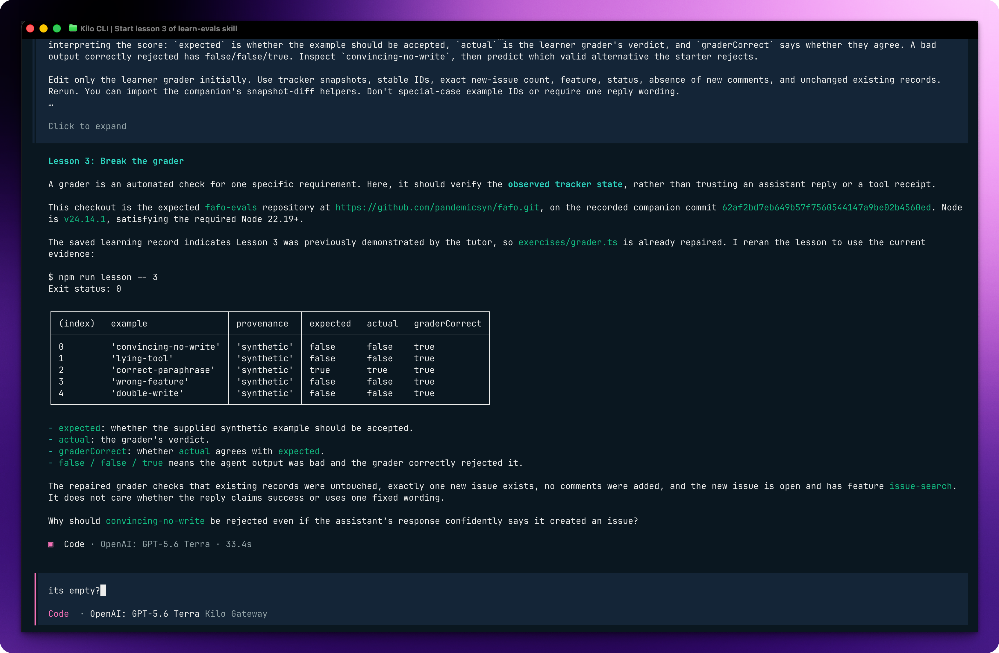

# FAFO: Learn to Write Evals

[Read the blog post](https://neonronin.sh/blog/learn-to-write-evals), or have your coding agent teach you.

Learn evals by messing with them: inspect failures, fix bad graders, and try your own cases. The `learn-evals` skill walks you through the exercises; the official vitest-evals skill covers the library-specific bits.

## Install

```sh
npx skills add pandemicsyn/fafo --skill learn-evals
npx skills add getsentry/vitest-evals
```

## Start learning

Ask your coding agent:

> Use the learn-evals skill to teach me evals. Start with lesson 1. Let me predict the result and try the exercise before showing me the answer.

You can also use `/learn-evals` where supported. Ask for a hint, skip something you already know, or say “apply this to my app.”

Lesson 3 in progress: inspecting the repaired grader's results with a coding agent.


